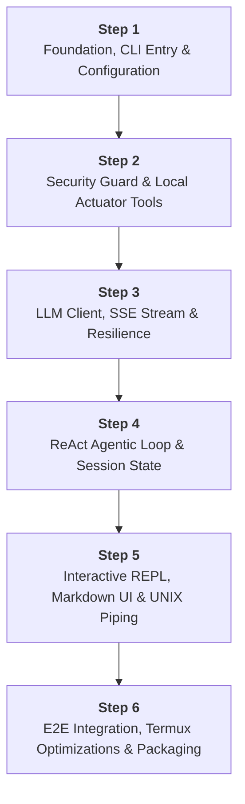

# Master Plan: Termux AI CLI (`termuxai`)

Dokumen ini adalah **Master Execution Plan** untuk pembangunan sistem **Termux AI CLI (`termuxai`)** secara menyeluruh berdasarkan [AI Termux.md](../AI%20Termux.md) (Product Requirements Document v1.0).

---

## 1. Filosofi & Prinsip Desain

1. **Zero Native C-Binding:**
   Semua modul dibangun menggunakan pustaka standar Node.js (`node:fs`, `node:child_process`, `node:readline`, `node:http`/`node:https`/`fetch`, `node:path`, `node:os`) atau pustaka JS murni yang sangat ringan. Menghindari `node-gyp` atau kompilasi C++ karena Termux berjalan di atas Android Bionic libc.
2. **Extreme Lightweight & Fast:**
   - Waktu inisialisasi / startup `< 300 ms`.
   - Penggunaan memori RAM `< 50 MB` dalam kondisi idle maupun saat eksekusi ReAct loop.
3. **Local Actuator with Security Boundary:**
   - AI memiliki kemampuan membaca, menulis, merefaktor kode, dan menjalankan perintah shell.
   - Dilengkapi sistem perizinan human-in-the-loop (`[y/N]`), safe-path jail (hanya CWD/proyek aktif), blacklist perintah berbahaya, serta timeout eksekusi.
4. **Resilient Agentic Loop (ReAct):**
   - Mendukung multi-turn autonomous reasoning and acting.
   - Self-healing bug fixing loop dengan penanganan kegagalan tool yang adaptif.
   - Manajemen sesi persisten (`~/.termuxai/sessions/`) dan pemangkasan token otomatis (*context pruning*).

---

## 2. Peta Pembagian Langkah (6 Steps Overview)

Total proses pembuatan sistem dibagi menjadi **6 Langkah Terstruktur**. Setiap langkah memiliki file panduan detail tersendiri di direktori `plans/`.

| Step | Dokumen Rencana | Deskripsi & Cakupan Utama | Estimasi Waktu |
|---|---|---|---|
| **Step 1** | [STEP_1_FOUNDATION_CONFIG.md](./STEP_1_FOUNDATION_CONFIG.md) | Setup Node.js ESM, entry point `bin/tai.js`, CLI argument parser, config manager (`~/.termuxai/config.json`), logger & ANSI format. | ~1 Turn |
| **Step 2** | [STEP_2_SECURITY_TOOLS.md](./STEP_2_SECURITY_TOOLS.md) | Security guard (safe path, command safety, confirmation prompt, timeout), 5 local tools (`read_file`, `write_file`, `patch_file`, `list_dir`, `execute_command`), tool registry & schemas. | ~1 Turn |
| **Step 3** | [STEP_3_LLM_STREAMING.md](./STEP_3_LLM_STREAMING.md) | LLM Client Gemini API (pure fetch), SSE streaming parser, tool call serializer/deserializer, exponential backoff retry (429/503). | ~1 Turn |
| **Step 4** | [STEP_4_REACT_AGENT_SESSION.md](./STEP_4_REACT_AGENT_SESSION.md) | ReAct orchestrator loop, handling tool dispatching & feedback, session persistence (`~/.termuxai/sessions/`), context pruning / token management. | ~1 Turn |
| **Step 5** | [STEP_5_REPL_UI_PIPING.md](./STEP_5_REPL_UI_PIPING.md) | Interactive REPL (`node:readline`), slash commands (`/help`, `/exit`, dll.), UNIX stdin piping, ANSI markdown renderer, syntax highlight, live spinner, SIGINT handling. | ~1 Turn |
| **Step 6** | [STEP_6_INTEGRATION_TERMUX_PACKAGING.md](./STEP_6_INTEGRATION_TERMUX_PACKAGING.md) | End-to-end testing, memory & startup benchmark, Termux path adjustments, global binary linkage (`termuxai`), `install.sh` script, documentation. | ~1 Turn |

---

## 3. Master Checklist Pelaksanaan

Gunakan checklist ini untuk memantau kemajuan pembangunan proyek:

### Step 1: Foundation, CLI Entry & Configuration
- [x] Inisialisasi `package.json` dengan Node.js ESM (`"type": "module"`) dan konfigurasi bin (`termuxai`).
- [x] Buat struktur folder proyek (`src/cli`, `src/config`, `src/tools`, `src/security`, `src/llm`, `src/agent`, `src/ui`, `src/utils`).
- [x] Implementasi CLI Argument Parser ringan (`src/cli/args.js`) untuk parsing flags (`--model`, `--api-key`, `--session`, `-y`, `--help`, dll.).
- [x] Implementasi Config Manager (`src/config/manager.js`) untuk membaca/menyimpan ke `~/.termuxai/config.json` dan membaca environment variable `GEMINI_API_KEY`, `TERMUXAI_API_KEY`.
- [x] Implementasi Utility Format & Logger (`src/utils/logger.js`, `src/utils/ansi.js`).
- [x] Implementasi CLI Sub-commands (`termuxai config set <key> <val>`, `termuxai config get <key>`, `termuxai --help`, `termuxai --version`).
- [x] Pengujian & Verifikasi Step 1 lulus uji.

### Step 2: Security Guard & Local Actuator Tools
- [x] Implementasi `SecurityGuard` (`src/security/guard.js`):
  - [x] Validasi batas direktori kerja (*safe-path boundary*).
  - [x] Deteksi pola perintah berbahaya (blacklist: `rm -rf /`, `mkfs`, dll.).
  - [x] Deteksi operasi berisiko tinggi (memerlukan konfirmasi `[y/N]` dari user).
  - [x] Mekanisme timeout eksekusi (default: 30 detik) dengan `AbortController`.
- [x] Implementasi Core Tools (`src/tools/`):
  - [x] `read_file.js`: membaca file dengan startLine/endLine, batas ukuran memori, deteksi binary file.
  - [x] `write_file.js`: penulisan file aman dengan validasi direktori & auto-create folder.
  - [x] `patch_file.js`: manipulasi search-and-replace / diff patching efisien token.
  - [x] `list_dir.js`: penjelajah direktori rekursif/depth, otomatis abaikan `.git` dan `node_modules`.
  - [x] `execute_command.js`: eksekusi shell command lokal via `child_process.spawn` dengan capture stdout/stderr dan exit code.
- [x] Implementasi Tool Registry & JSON Schema Generator (`src/tools/registry.js`) untuk Gemini function declarations.
- [x] Pengujian unit test untuk seluruh tools dan security guard lulus uji.

### Step 3: LLM Client, SSE Streaming & Network Resilience
- [x] Implementasi Gemini API Client murni berbasis `fetch` (`src/llm/gemini.js`).
- [x] Implementasi SSE (Server-Sent Events) Stream Parser (`src/llm/stream-parser.js`) untuk token streaming dan parsing tool call JSON chunks.
- [x] Implementasi Network Resilience Layer (`src/llm/retry.js`):
  - [x] Exponential backoff retry (maksimal 3x) untuk HTTP 429 (Rate Limit) dan HTTP 503 (Overloaded).
  - [x] Penanganan timeout jaringan dan `AbortSignal`.
- [x] Dukungan Dynamic Model Switching (`gemini-2.5-flash`, `gemini-2.5-pro`, `gemini-1.5-flash`).
- [x] Pengujian unit test LLM client, retry handler, dan stream parser lulus uji.

### Step 4: ReAct Agentic Loop & Session State Engine
- [x] Implementasi Agent Orchestrator (`src/agent/orchestrator.js`):
  - [x] ReAct reasoning-acting loop (Prompt -> LLM Stream -> Tool Call -> Security Guard -> Actuator -> Function Response -> LLM).
  - [x] Multi-turn tool execution dalam satu prompt jika model memerlukan beberapa aksi bertahap.
  - [x] Pencegahan infinite loop / max steps limit per turn.
  - [x] Error feedback injection (jika tool gagal dieksekusi, berikan error ke LLM agar memperbaiki diri).
- [x] Implementasi Session State Manager (`src/agent/session.js`):
  - [x] Penyimpanan riwayat sesi atomik ke `~/.termuxai/sessions/<session-id>.json`.
  - [x] Dukungan resume sesi (`termuxai resume <session-id>` atau `termuxai --session <id>`).
  - [x] Algoritma Context Pruning (pemangkasan histori jika akumulasi token mendekati batas limit model).
- [x] Pengujian integrasi ReAct loop dan session persistence lulus uji.

### Step 5: Interactive REPL, Output Rendering & UNIX Piping
- [x] Implementasi Interactive REPL (`src/cli/repl.js`):
  - [x] Menggunakan `node:readline` dengan dukungan multi-turn dan history.
  - [x] Perintah slash (`/help`, `/model`, `/session`, `/clear`, `/config`, `/exit`).
- [x] Implementasi Mode Single-Shot (`termuxai "buat fungsi kalkulator"`).
- [x] Implementasi UNIX Pipe & Stdin Stream (`cat access.log | termuxai "analisis IP"`).
- [x] Implementasi Terminal UI Renderer (`src/ui/`):
  - [x] ANSI Markdown renderer (headers, bold, lists, quotes, tables).
  - [x] Code syntax highlighter murni berbasis regex/ANSI tanpa dependensi native.
  - [x] Visual Live Spinner / Status Badge saat LLM berpikir dan saat tool berjalan.
- [x] Implementasi graceful SIGINT (Ctrl+C): membatalkan permintaan LLM/eksekusi tool saat ini tanpa menutup sesi REPL.
- [x] Pengujian antarmuka REPL, piping, dan formatting visual terminal lulus uji.

### Step 6: End-to-End Integration, Termux Optimization & Packaging
- [x] Pengujian End-to-End skenario nyata:
  - [x] Eksplorasi folder & pembuatan file baru.
  - [x] Skenario Self-Healing Bug Fixing (tulis kode -> jalankan tes -> revisi sampai lulus).
  - [x] Skenario Piping stdin dari log file.
- [x] Optimalisasi Lingkungan Termux:
  - [x] Verifikasi konsumsi RAM (< 50MB). ✅ 46.07 MB
  - [x] Verifikasi startup latency (< 300ms). ✅ avg 99.60 ms
  - [x] Penyesuaian path default Android Termux (`/data/data/com.termux/files/home`).
- [x] Packaging & Setup Distribusi:
  - [x] Konfigurasi global npm link (`npm link` / `npm install -g .`).
  - [x] Pembuatan script installer one-line (`install.sh`).
  - [x] Pembuatan dokumentasi panduan lengkap (`README.md`).

---

## 4. Panduan Eksekusi Step-by-Step

Untuk menjalankan proses pembuatan secara bertahap tanpa error dan terarah:

1. **Jalankan Step 1:** Berikan instruksi:
   > *"Jalankan pengerjaan Step 1 sesuai dokumen [plans/STEP_1_FOUNDATION_CONFIG.md](./STEP_1_FOUNDATION_CONFIG.md)"*
2. **Validasi Step 1:** Pastikan semua unit test & binary test Step 1 selesai dan centang checklist di atas.
3. **Lanjutkan ke Step 2:** Berikan instruksi:
   > *"Jalankan pengerjaan Step 2 sesuai dokumen [plans/STEP_2_SECURITY_TOOLS.md](./STEP_2_SECURITY_TOOLS.md)"*
4. Ulangi proses hingga **Step 6** selesai secara tuntas.
