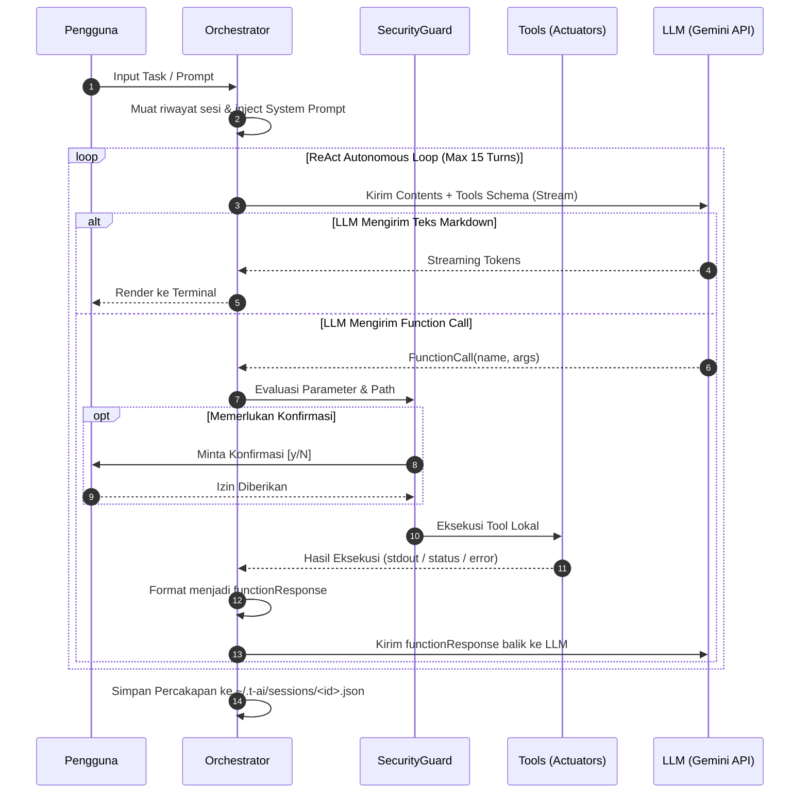

# Step 4: ReAct Agentic Loop & Conversation State Engine

Dokumen ini berisi panduan implementasi teknis untuk **Step 4** pada proyek **Termux AI CLI (`t-ai`)**.

---

## 1. Tujuan & Ruang Lingkup (Objectives & Scope)

Membangun inti kecerdasan otonom (*Agent Orchestrator*) menggunakan paradigma **ReAct (Reasoning + Acting)**. Orchestrator bertanggung jawab mengoordinasikan interaksi antara LLM (Step 3), alat lokal & sistem keamanan (Step 2), dan pengguna. Selain itu, modul ini menyediakan **Session & Context Manager** untuk persistensi sesi percakapan ke disk (`~/.t-ai/sessions/`), dukungan resume sesi, serta algoritma pemangkasan konteks (*Context Pruning*) untuk mencegah pemborosan token.

---

## 2. Spesifikasi Teknis & Struktur Berkas

### 2.1 Struktur Berkas yang Dibuat di Step 4
```
ai-termux/
├── src/
│   ├── agent/
│   │   ├── orchestrator.js    # Core ReAct loop execution engine
│   │   ├── system-prompt.js   # System instructions & environment context injector
│   │   ├── session.js         # Atomic session storage & history manager (~/.t-ai/sessions)
│   │   └── pruner.js          # Context pruning & token estimation algorithm
└── tests/
    ├── step4-orchestrator.test.js # Integration test for ReAct execution loop
    └── step4-session.test.js      # Unit test for session saving, resuming & pruning
```

---

## 3. Detail Implementasi Modul

### 3.1 System Prompt & Context Injection (`src/agent/system-prompt.js`)

* Menginjeksikan informasi lingkungan lokal Termux ke model:
  - Direktori kerja aktif (*Current Working Directory*).
  - Sistem Operasi (`Android Termux / Linux`).
  - Arsitektur (`arm64`, `arm`, `x64`).
  - Versi Node.js.
  - Tanggal dan waktu saat ini.
* Pedoman perilaku agen:
  - Berpikir sebelum bertindak (state reasoning).
  - Menulis kode modular dan bersih.
  - Memeriksa file sebelum melakukan patch/modifikasi.
  - Menguji kode setelah melakukan perubahan jika memungkinkan (*self-healing loop*).

---

### 3.2 Agent Orchestrator (`src/agent/orchestrator.js`)

Orchestrator menjalankan siklus ReAct dengan alur kerja berikut:



* **Pencegahan Infinite Loop:** Batas iterasi maksimum per perintah pengguna (default: `15` iterasi loop per instruksi).
* **Self-Correction & Error Feedback:** Jika tool menghasilkan error (misal: syntax error saat menjalankan `node script.js` atau path tidak ditemukan), pesan error dikirimkan kembali ke LLM dalam payload `functionResponse` agar model dapat menganalisis dan memperbaiki kodenya secara mandiri.

---

### 3.3 Session Manager (`src/agent/session.js`)

* **Struktur Berkas Sesi (`~/.t-ai/sessions/<session-id>.json`):**
  ```json
  {
    "id": "sess_1724238912_abc123",
    "createdAt": "2026-08-21T18:45:00Z",
    "updatedAt": "2026-08-21T18:46:30Z",
    "model": "gemini-2.5-flash",
    "workingDir": "/data/data/com.termux/files/home/my-project",
    "messages": [
      { "role": "user", "parts": [{ "text": "buatkan index.js" }] },
      { "role": "model", "parts": [{ "functionCall": { "name": "write_file", "args": { ... } } }] },
      { "role": "function", "parts": [{ "functionResponse": { "name": "write_file", "response": { "status": "ok" } } }] },
      { "role": "model", "parts": [{ "text": "File index.js berhasil dibuat!" }] }
    ]
  }
  ```
* **Metode Utama:**
  - `createSession(options)`: Membuat identitas sesi baru dengan timestamp.
  - `saveSession(session)`: Menyimpan state secara atomik di setiap pergantian percakapan (*turn*).
  - `loadSession(sessionId)`: Membaca riwayat sesi yang tersimpan.
  - `listSessions()`: Menampilkan daftar riwayat sesi yang tersedia.

---

### 3.4 Context Pruning (`src/agent/pruner.js`)

* Memperkirakan jumlah token dalam memori secara cepat (karakter / 4 rasio estimasi).
* Jika total token mendekati ambang batas (contoh: > 800.000 token):
  - Pertahankan pesan pertama (injeksi konteks penting awal).
  - Pangkas pesan lama di bagian tengah percakapan (*sliding window*).
  - Pertahankan $N$ percakapan terakhir agar agen tidak kehilangan memori jangka pendek.

---

## 4. Pengujian & Verifikasi (Test Suite)

1. **Orchestrator Integration Tests (`tests/step4-orchestrator.test.js`):**
   - Menguji alur ReAct satu langkah (LLM memanggil `read_file` -> dieksekusi -> LLM menjawab).
   - Menguji skenario multi-step tool calls (LLM membaca file -> menulis revisi -> menjalankan tes).
   - Menguji penanganan feedback error saat eksekusi tool gagal.
   - Menguji perlindungan batas maksimal iterasi (anti-infinite loop).
2. **Session & Pruner Tests (`tests/step4-session.test.js`):**
   - Menguji pembuatan, penyimpanan, dan pembacaan ulang file sesi.
   - Menguji pemangkasan otomatis histori percakapan saat batas token terlampaui.

---

## 5. Checklist Penyelesaian Step 4

- [ ] Modul `SystemPrompt` menginjeksi informasi sistem Termux dan petunjuk agen secara akurat.
- [ ] `AgentOrchestrator` berhasil menjalankan siklus ReAct dan merespon `functionCall` secara otomatis.
- [ ] Batas maksimal loop ReAct berjalan efektif mencegah perulangan tanpa akhir.
- [ ] `SessionManager` menyimpan dan memuat file sesi di `~/.t-ai/sessions/` dengan integritas penuh.
- [ ] Algoritma `ContextPruning` memangkas token tanpa merusak format percakapan.
- [ ] Seluruh unit test Step 4 lulus (`npm test`).

---

## 6. Transisi ke Langkah Berikutnya

Setelah Step 4 selesai dan diverifikasi:
👉 **Lanjutkan ke [Step 5: Interactive REPL, Output Rendering & UNIX Piping (STEP_5_REPL_UI_PIPING.md)](./STEP_5_REPL_UI_PIPING.md)**.
